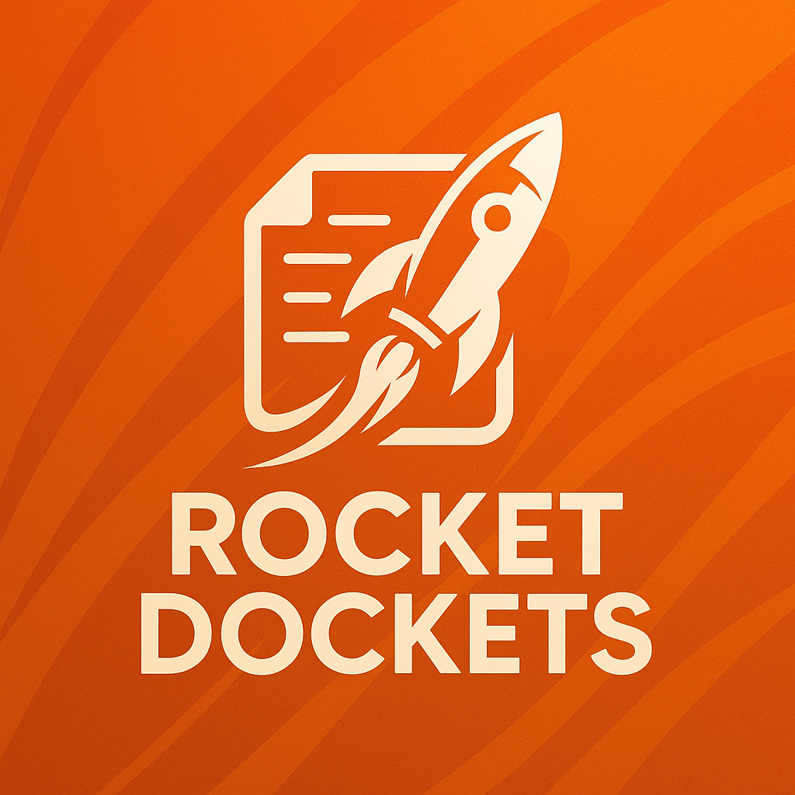

# 🚀 Rocket Dockets

**Rocket Dockets** is a lightweight, AI-powered document management platform designed for fast, intelligent processing of financial documents—receipts, invoices, and delivery dockets. Built for freelancers, small businesses, and growing enterprises, it offers real-time OCR scanning, procurement traceability, and a secure, serverless backend infrastructure.

---

## 🔍 Table of Contents

- [Overview](#overview)
- [Core Features](#core-features)
- [Target Users](#target-users)
- [Technology Stack](#technology-stack)
- [Architecture Overview](#architecture-overview)
- [Getting Started](#getting-started)
- [Pricing Model](#pricing-model)
- [Roadmap](#roadmap)
- [Security & Compliance](#security--compliance)
- [Contributing](#contributing)
- [License](#license)
- [Contact](#contact)

---

## 📌 Overview

Rocket Dockets enables users to:

- **Upload financial documents** (PDF or image)
- **Preview scanned receipts** in real time
- **Extract structured data** using Azure's Form Recognizer
- **Avoid duplicates** with smart document fingerprinting
- **Track document chains** for procurement verification
- **Store results securely** in a scalable cloud backend

This tool is especially valuable for those managing frequent financial paperwork and seeking automation without enterprise-level costs.

---

## 🚀 Core Features

| Feature                             | Description                                                                 |
|-------------------------------------|-----------------------------------------------------------------------------|
| Document Upload                     | PDF/image file support with drag-and-drop or file picker                    |
| Real-Time Preview                   | Responsive visual feedback of scanned content                              |
| Azure OCR Integration               | High-accuracy OCR using Azure Form Recognizer                              |
| Duplicate Detection                 | Blocks re-uploading of previously scanned documents                        |
| Document Matching                   | (Phase 2) Links delivery dockets to invoices for verification              |
| Category Classification             | (Planned) Auto-sorts documents by type, date, and merchant                 |
| Cloud Storage Ready                 | Secure S3-compatible storage architecture                                  |
| Multi-Platform Support              | Optimized for mobile, tablet, and desktop                                  |

---

## 🎯 Target Users

- **Small Business Owners & Contractors**
- **Accountants & Admin Staff**
- **Freelancers & Tradespeople**
- **Procurement/Operations Managers**
- **Automation Enthusiasts (NZ, AUS, USA, CAN)**

---

## 🧰 Technology Stack

| Layer        | Tool/Service                              |
|--------------|-------------------------------------------|
| **Frontend** | Cursor (HTML/CSS/JS), Webflow (landing)   |
| **Backend**  | AWS Lambda, API Gateway                   |
| **OCR**      | Azure Form Recognizer (Document Intelligence) |
| **Hosting**  | Netlify / Vercel                          |
| **Database** | Google Sheets (trial), Supabase/Firebase (prod) |
| **Storage**  | AWS S3 or compatible object storage       |
| **Payments** | Stripe                                    |
| **AI Assist**| ChatGPT (Pro), Google Gemini (validation) |
| **Imagery**  | DALL·E, Midjourney                        |

---

## 🏗 Architecture Overview

```txt
[Frontend (scan-receipt.html)]
     |
     | -> [Preview UI + Scan Button]
     |
     v
[API Gateway Endpoint]
     |
     v
[AWS Lambda Function]
     |
     v
[Azure Form Recognizer]
     |
     v
[Parsed JSON Results]
     |
     +--> Google Sheets / Supabase
     +--> Returned to UI for review
